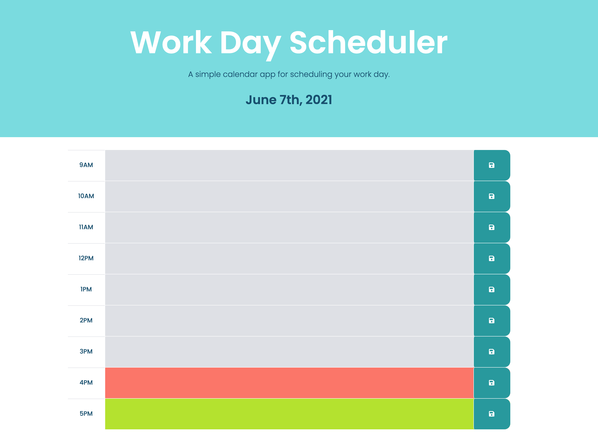

# work-day-scheduler

A simple calendar application that allows a user to save events for each hour of the day by clicking into the field for that cooresponding time and editing the events. The save button allows the data to be stored in local storage and keeps the information in the schedule. 

The hour blocks will turn gray when that time has passed. The current hour block is displayed in red and the future hour blocks are displayed in green.

The link to the live page: https://af-cmdz.github.io/work-day-scheduler/

Screen shot of finished page:

